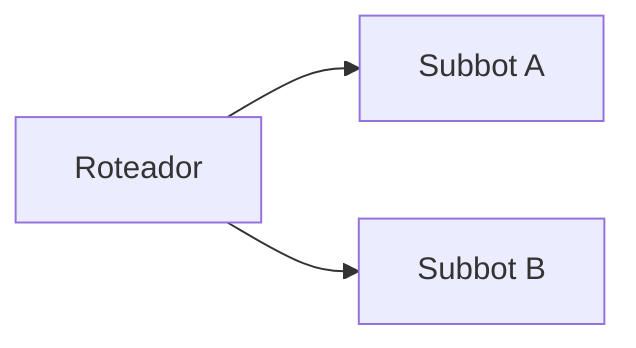

# Especificação (as-is) — {{CONTRATO}}

> Retrato do que está **em produção**. Gerada pela engenharia reversa da skill `blip-spec-driven` e atualizada pela `blip-promover` a cada publicação.
> Última atualização: {{DATA}}

## 1. Visão geral
(2–3 frases: o que o conjunto de bots faz para o usuário final.)

## 2. Topologia

## 3. Bots
### 3.1 <nome do bot> (`<identificador>`)
- **Objetivo:**
- **Jornada principal:** bloco → bloco → bloco
- **Entradas e validações:**
- **Integrações HTTP:** `MÉTODO {{resource.x}}/caminho` → salva `variavel`
- **Transbordos:** fila / condição
- **Variáveis:** contexto · contato · config
- **Pontos de atenção:** (resultado do blip-audit, riscos)

## 4. Integrações
| Sistema | Endpoint | Usado por | Observação |
|---|---|---|---|

## 5. Configurações e recursos
Ver `prd/RECURSOS.md`.

## 6. Pontos de atenção gerais
-
