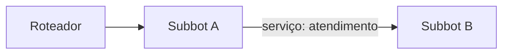

# Especificação (as-is) — {{CONTRATO}}

> Retrato do que está **em produção**. Gerada pelas skills `blip-mapear-router` e `blip-spec-driven` (engenharia reversa) e atualizada pela `blip-promover` a cada publicação.
> Última atualização: {{DATA}}

## 1. Visão geral
(2–3 frases: o que o conjunto de bots faz para o usuário final.)

## 2. Mapa do router
Fonte dos serviços: tela de serviços do roteador no portal (ou `blip-router.mjs descobrir`). Fonte dos arquivos: `prd/fluxos/` baixados por `blip-router.mjs baixar`.

| Serviço no router | Bot no Blip (identificador) | Arquivo em `prd/fluxos/` | Frame(s) do Figma | Correspondência | Observação |
|---|---|---|---|---|---|
| `captacao` | `<identificador>` | `<identificador>.json` | `CAPTACAO.png` | Alta / Parcial / Sem correspondência | |

**Correspondência:** *Alta* = a maioria das mensagens do frame está no bot; *Parcial* = parte está, com diferenças relevantes (listar em §4); *Sem correspondência* = frame sem bot ou bot sem frame.

## 3. Topologia
Quem redireciona para quem (ações `Redirect`, gerado por `blip-router.mjs topologia` e revisado).

## 4. Bots
### 4.1 <nome do bot> (`<identificador>`, serviço `<servico>`)
- **Objetivo:**
- **Frame(s) do Figma:** (e diferenças em relação ao Figma, se a correspondência for parcial)
- **Jornada principal:** bloco → bloco → bloco
- **Entradas e validações:**
- **Integrações HTTP:** `MÉTODO {{resource.x}}/caminho` → salva `variavel`
- **Transbordos e redirecionamentos:** fila / serviço / condição
- **Variáveis:** contexto · contato · config
- **Pontos de atenção:** (resultado do blip-audit, credenciais escritas, riscos)

## 5. Integrações
| Sistema | Endpoint | Usado por | Observação |
|---|---|---|---|

## 6. Configurações e recursos
Ver `prd/RECURSOS.md`.

## 7. Pendências do mapeamento
- [ ] Bots do router sem key no ambiente (não baixados):
- [ ] Serviços citados em redirects sem bot conhecido:
- [ ] Frames do Figma sem bot / bots sem frame:
- [ ] Fluxos com credencial escrita (P-014):
