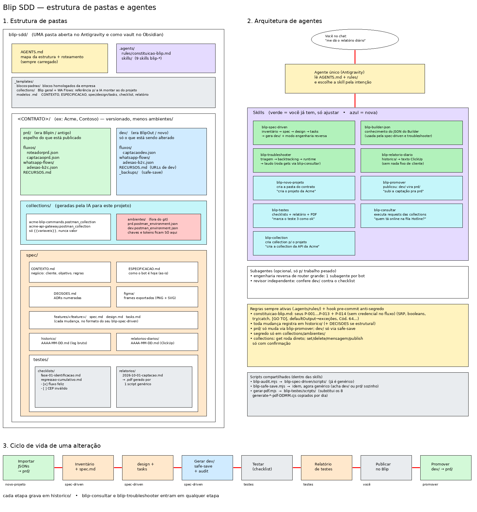

# Blip SDD — kit de agentes para projetos no Take Blip

Workspace pronto para o **Antigravity** (e para abrir como vault no **Obsidian**) que organiza projetos de chatbot no Blip com **Spec-Driven Development**: cada cliente vira uma pasta com produção, desenvolvimento, collections e especificação, e um agente único com skills especializadas cuida de especificar, gerar o JSON, testar, consultar a plataforma e registrar tudo.



## O que tem aqui

```
blip-sdd/
├── AGENTS.md                 ← mapa do workspace + roteamento de intenções (o agente lê sempre)
├── .agents/
│   ├── rules/
│   │   ├── constituicao-blip.md     ← P-001…P-013: regras inegociáveis do JSON
│   │   └── governanca-projeto.md    ← prd/dev, histórico, segredos, confirmação de escrita
│   └── skills/
│       ├── blip-spec-driven/        ← SDD completo + engenharia reversa (+ audit e safe-save)
│       ├── blip-builder-json/       ← referência do JSON do Builder e Script V2
│       ├── blip-troubleshooter/     ← diagnóstico de bugs em 4 fases
│       ├── blip-relatorio-diario/   ← relatório do dia no padrão ClickUp
│       ├── blip-novo-projeto/       ← cria a pasta de um cliente
│       ├── blip-promover/           ← atualiza prd/ depois de publicar
│       ├── blip-testes/             ← checklists, relatório de testes e PDF
│       ├── blip-consultar/          ← executa requests das collections
│       └── blip-collection/         ← cria collections para APIs do projeto
├── _templates/
│   ├── contrato/             ← esqueleto de um cliente novo
│   ├── feature/              ← spec.md, design.md, tasks.md
│   ├── collections/          ← collections de referência (Blip geral, WhatsApp Flows)
│   ├── blocos-padrao/        ← blocos padrão da empresa
│   └── *.md                  ← histórico do dia, checklist, relatório de testes
└── docs/                     ← arquitetura e decisões deste kit
```

Cada **contrato** (cliente) criado dentro do workspace fica assim e também é versionado (repositório privado), menos os segredos:

```
Acme/
├── prd/          ← espelho do que está publicado (fluxos/, whatsapp-flows/, RECURSOS.md)
├── dev/          ← só o que está sendo alterado (+ _backups/ do safe-save)
├── collections/  ← collections do projeto + ambientes/ (chaves e tokens)
└── spec/         ← CONTEXTO, ESPECIFICACAO, DECISOES, figma/, features/, historico/,
                    relatorios-diarios/, testes/
```

## Como usar

1. Copie (ou clone) este kit para a raiz da sua pasta de contratos — ela vira o workspace — e abra essa pasta no Antigravity. Versione o workspace num repositório **privado**; este repositório aqui guarda só o kit.
2. Ative a checagem de segredos (uma vez por clone): `git config core.hooksPath .githooks`.
3. Coloque os blocos padrão da empresa em `_templates/blocos-padrao/`.
4. Converse normalmente; o agente escolhe a skill pela intenção:

| Você diz | O que acontece |
|---|---|
| "cria o projeto da Acme" | `blip-novo-projeto` monta `Acme/` a partir do template |
| "coloquei os fluxos de produção, especifica esse router" | `blip-spec-driven` faz engenharia reversa e escreve `ESPECIFICACAO.md` |
| "muda o menu da captação pra ter a opção X" | `blip-spec-driven`: spec → design → tasks → JSON em `dev/` com safe-save |
| "o bot não pediu o CNPJ, olha esse print" | `blip-troubleshooter` investiga, corrige em `dev/` e registra |
| "quantos tickets tem na fila Hotline?" | `blip-consultar` roda a request com o ambiente do projeto |
| "cria a collection da API de viabilidade do cliente" | `blip-collection` gera a collection só com `{{variáveis}}` |
| "faz o checklist da fase 2" / "marca o TC-003 como ok" / "gera o PDF" | `blip-testes` |
| "publiquei a captação" | `blip-promover` atualiza `prd/`, a especificação e o histórico |
| "me dá o relatório diário" | `blip-relatorio-diario` monta o texto do ClickUp a partir do histórico |

## Scripts

Todos rodam com Node 18+ e não têm dependências npm.

| Script | Para quê |
|---|---|
| `blip-spec-driven/scripts/blip-audit.mjs <fluxo.json>` | Auditoria mecânica: conexões, órfãos, Cód. 64, `[GO TO]`, Script V2 (`var`, `try/catch`, `@`) |
| `blip-spec-driven/scripts/blip-safe-save.mjs <alvo> <novo> [--allow-delete ids]` | Grava com backup, trava de deleção de blocos e rollback se a auditoria reprovar; bloqueia `prd/` |
| `blip-consultar/scripts/blip-request.mjs <collection> --listar` / `"<request>" --ambiente <env>` | Lista e executa requests; escrita só com `--confirmar`; não imprime chaves |
| `blip-testes/scripts/gerar-pdf.mjs <arquivo.md>` | Markdown → PDF via Edge/Chrome headless, com barra de progresso para checklists |

## Segurança

Este repositório guarda só o kit. O workspace onde você trabalha (kit + pastas de contrato) vai para um repositório **privado**, e três camadas evitam que segredo vá junto:

1. **`.gitignore`**: `collections/ambientes/` (chaves e tokens), `_backups/` e `_scratch/` nunca entram.
2. **Hook `pre-commit`** (`.githooks/checar-segredos.mjs`): bloqueia o commit se encontrar chave Blip (`Key …`), `Bearer`, JWT, chave privada ou campo de senha/token preenchido em qualquer arquivo, inclusive dentro do JSON exportado do Studio. Antes do primeiro commit, rode `node .githooks/checar-segredos.mjs --todos`.
3. **Constituição P-014 + `blip-audit.mjs`**: fluxo com credencial escrita em header HTTP reprova na auditoria; a chave vai para `{{resource.x}}`/`{{config.x}}` no Studio.

Toda chamada que altera algo na plataforma (set, delete, envio de mensagem, publicar flow) exige confirmação explícita.

Detalhes das decisões de arquitetura em [`docs/ARQUITETURA.md`](docs/ARQUITETURA.md). O diagrama editável está em `docs/estrutura-projeto-blip.excalidraw` (abre no excalidraw.com ou no plugin Excalidraw do Obsidian).
