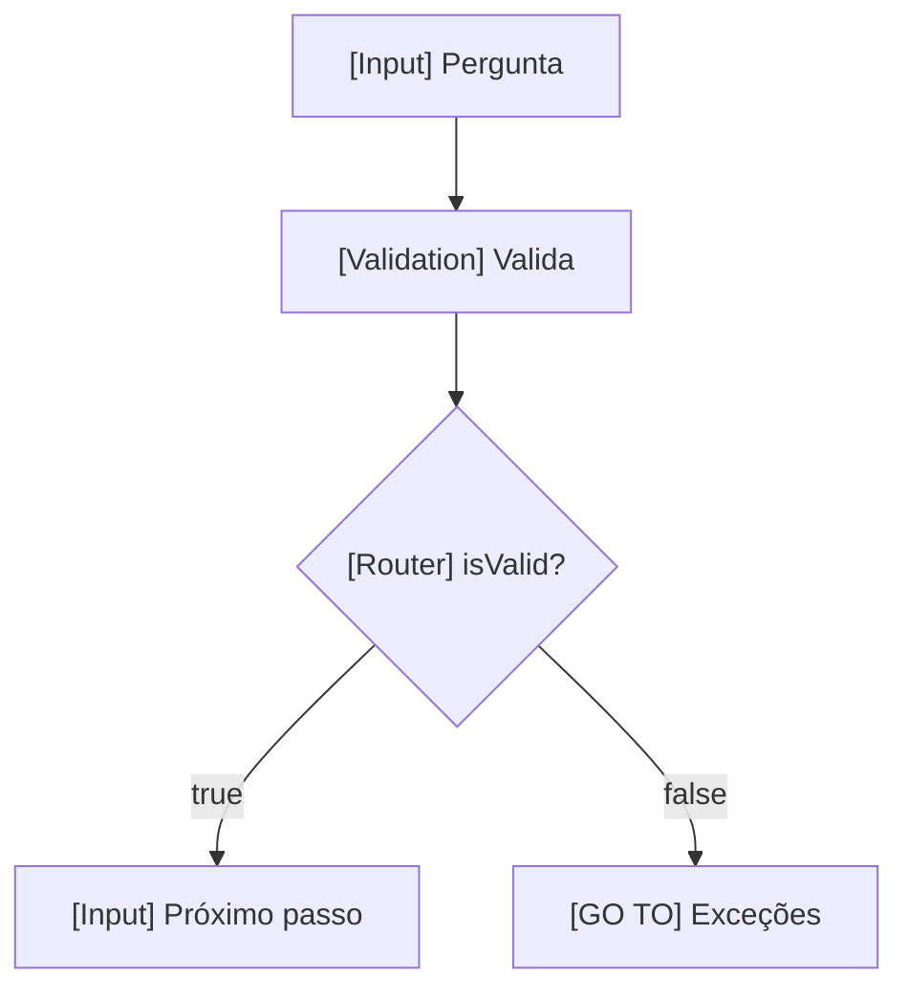

# Design — <feature>

> Refs: `spec.md` desta pasta · Versão 0.1

## 1. Arquitetura e fronteiras
- Orquestrador / subbots envolvidos:
- Pasta visual no Studio:

## 2. Máquina de estados

## 3. Contrato de dados
| Variável | Tipo | Escrita em | Lida em |
|---|---|---|---|
| `isValid` | boolean | `[Validation] Valida` | `[Router] isValid?` |

**config.\* a cadastrar manualmente:**
| Bot | Chave | Valor (ambiente) |
|---|---|---|

## 4. Hand-offs
| Condição | Ação | Serviço de destino |
|---|---|---|

## 5. Integrações HTTP
| Bloco | Método e endpoint | Body | Salva no 200 | Falha |
|---|---|---|---|---|
